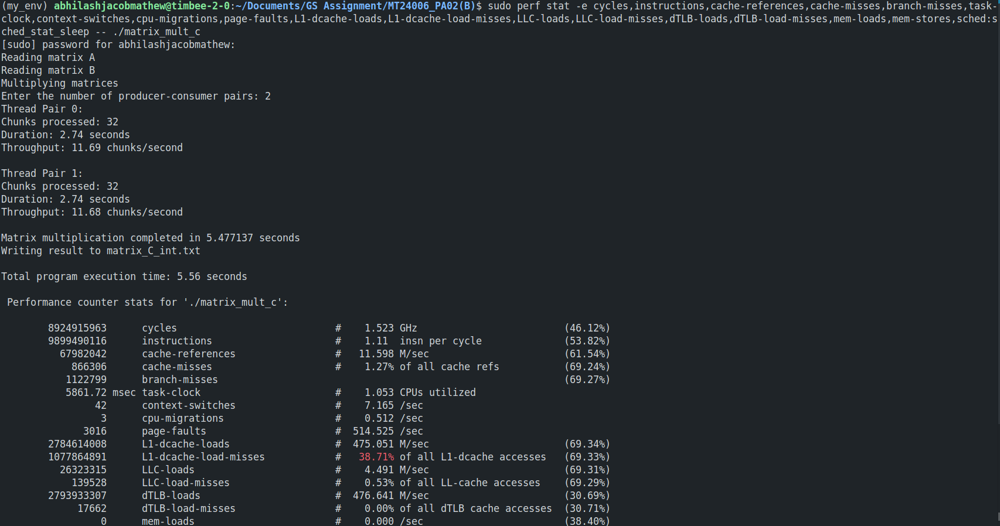
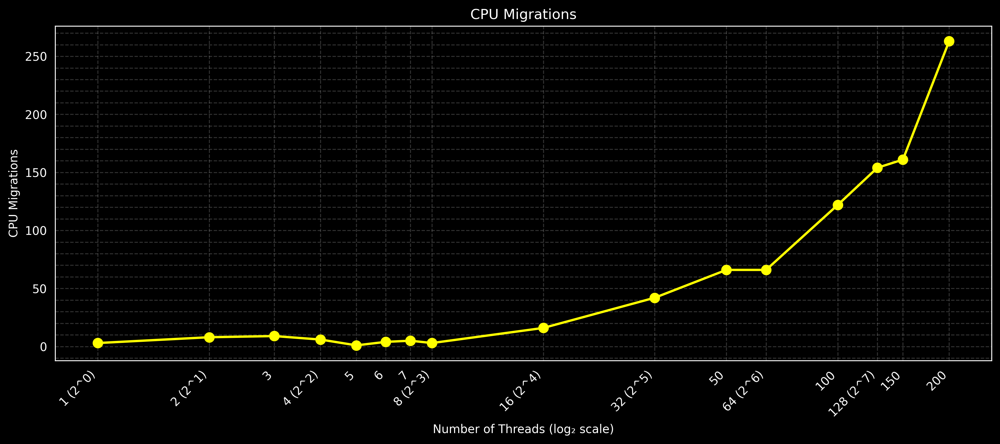

# Multithreaded Matrix Multiplication with Producer-Consumer Pattern

This report analyzes a multithreaded matrix multiplication implementation using the Producer-Consumer pattern. The program multiplies two 1000×1000 matrices using multiple thread pairs, with each pair consisting of a producer and consumer thread working on a shared buffer.

## Implementation Details

### Producer-Consumer Architecture

The program implements a concurrent matrix multiplication algorithm with the following characteristics:

1. **Thread Pairs**: The implementation uses multiple producer-consumer thread pairs, where each pair operates on its own dedicated buffer.

2. **Work Distribution**: The matrix multiplication task is divided into chunks, with each producer thread responsible for generating work items that specify which rows of the result matrix to compute.

3. **Circular Buffer**: Each producer-consumer pair shares a fixed-size circular buffer (size: 32) for task coordination.

4. **Chunk-based Processing**: The work is divided into chunks of 16 rows each to balance the granularity of tasks and minimize synchronization overhead.

### Synchronization Mechanisms

The program uses several synchronization primitives to ensure thread safety:

1. **Mutex Locks**:
   - Each circular buffer has a mutex to protect access to its internal state.
   - The result matrix has a separate mutex for each row to allow fine-grained synchronization.

2. **Condition Variables**:
   - `not_full`: Producers wait on this when the buffer is full.
   - `not_empty`: Consumers wait on this when the buffer is empty.

3. **Buffer State Tracking**:
   - `count`: Tracks the number of items in the buffer.
   - `done`: Signals when a producer has finished generating all work items.

### Code Structure

The key components of the implementation include:

```c
// Work item structure - specifies a range of rows to process
typedef struct {
    int start_row;
    int end_row;
} WorkItem;

// Circular buffer structure - shared between a producer-consumer pair
typedef struct {
    WorkItem buffer[BUFFER_SIZE];  // Buffer size is 32
    int in;                        // Producer insert index
    int out;                       // Consumer remove index
    int count;                     // Number of items in buffer
    pthread_mutex_t mutex;         // Protects buffer access
    pthread_cond_t not_full;       // Signals buffer has space
    pthread_cond_t not_empty;      // Signals buffer has items
    int done;                      // Indicates producer is finished
} CircularBuffer;
```

### Producer Thread Function

The producer thread divides its assigned portion of the matrix into chunks and places them into the shared buffer:

```c
void *producer(void *arg) {
    // Calculate the rows this producer is responsible for
    int rows_per_pair = MATRIX_SIZE / pair->total_pairs;
    int start = pair->pair_id * rows_per_pair;
    int end = (pair->pair_id == pair->total_pairs - 1) ? MATRIX_SIZE 
                                                      : start + rows_per_pair;

    // Generate work items for chunks of rows
    for (int start_row = start; start_row < end; start_row += CHUNK_SIZE) {
        // Wait if buffer is full
        pthread_mutex_lock(&buffer->mutex);
        while (buffer->count == BUFFER_SIZE) {
            pthread_cond_wait(&buffer->not_full, &buffer->mutex);
        }
        
        // Create and insert work item
        WorkItem item;
        item.start_row = start_row;
        item.end_row = min(start_row + CHUNK_SIZE, end);
        
        buffer->buffer[buffer->in] = item;
        buffer->in = (buffer->in + 1) % BUFFER_SIZE;
        buffer->count++;
        
        pthread_cond_signal(&buffer->not_empty);
        pthread_mutex_unlock(&buffer->mutex);
    }
    
    // Signal that all work items have been produced
    pthread_mutex_lock(&buffer->mutex);
    buffer->done = 1;
    pthread_cond_broadcast(&buffer->not_empty);
    pthread_mutex_unlock(&buffer->mutex);
}
```

### Consumer Thread Function

The consumer thread processes work items from the shared buffer, performing matrix multiplication for the specified rows:

```c
void *consumer(void *arg) {
    while (1) {
        // Wait if buffer is empty
        pthread_mutex_lock(&buffer->mutex);
        while (buffer->count == 0) {
            if (buffer->done) {
                pthread_mutex_unlock(&buffer->mutex);
                return NULL;  // Exit if producer is finished
            }
            pthread_cond_wait(&buffer->not_empty, &buffer->mutex);
        }
        
        // Get work item
        WorkItem item = buffer->buffer[buffer->out];
        buffer->out = (buffer->out + 1) % BUFFER_SIZE;
        buffer->count--;
        
        pthread_cond_signal(&buffer->not_full);
        pthread_mutex_unlock(&buffer->mutex);
        
        // Process the matrix multiplication for these rows
        for (int i = item.start_row; i < item.end_row; i++) {
            for (int j = 0; j < MATRIX_SIZE; j++) {
                int sum = 0;
                for (int k = 0; k < MATRIX_SIZE; k++) {
                    sum += pair->A[i][k] * pair->B[k][j];
                }
                
                // Protect writes to result matrix
                pthread_mutex_lock(&pair->result_mutex[i]);
                pair->C[i][j] = sum;
                pthread_mutex_unlock(&pair->result_mutex[i]);
            }
        }
        
        pair->items_processed++;  // Track processed chunks for metrics
    }
}
```

## Usage

### Build and Run

- To build the program, run:
  make
- To run the program, execute:
  ./matrix_mult_c

### Detailed Performance Analysis

Run the following command to analyze performance metrics using perf:
  
  sudo perf stat -e cycles,instructions,cache-references,cache-misses,branch-misses,task-clock,context-switches,cpu-migrations,page-faults,L1-dcache-loads,L1-dcache-load-misses,LLC-loads,LLC-load-misses,dTLB-loads,dTLB-load-misses,mem-loads,mem-stores,sched:sched_stat_sleep -- ./matrix_mult_c

### Producer-Consumer Output

Below is a screenshot showing the program output with 2 producer-consumer threads:



## Performance Analysis

### Execution Time vs. Number of Threads


**Analysis:**

- The execution time rapidly decreases as the number of threads increases from 1 to 8, showing good parallel speedup.
- The minimum execution time occurs at 50 and 100 threads (0.4 seconds), representing a 5.27x speedup over the single-threaded execution.
- After 100 threads, the execution time actually increases, indicating diminishing returns and overhead from excessive threading.

This pattern is typical of a memory-bound application where the benefits of parallelism are eventually outweighed by the costs of thread management, synchronization, and resource contention.

**Program Connection:**
The decreasing execution time initially corresponds to our effective work distribution strategy in the producer function:

```c
for (int start_row = start; start_row < end; start_row += CHUNK_SIZE) {
    // Wait if buffer is full
    pthread_mutex_lock(&buffer->mutex);
    while (buffer->count == BUFFER_SIZE) {
        pthread_cond_wait(&buffer->not_full, &buffer->mutex);
    }
    
    // Create and insert work item
    WorkItem item;
    item.start_row = start_row;
    item.end_row = min(start_row + CHUNK_SIZE, end);
    
    buffer->buffer[buffer->in] = item;
    buffer->in = (buffer->in + 1) % BUFFER_SIZE;
    buffer->count++;
    
    pthread_cond_signal(&buffer->not_empty);
    pthread_mutex_unlock(&buffer->mutex);
}
```

### CPU Utilization vs. Number of Threads


**Analysis:**

- CPU utilization increases steadily from 1 thread (0.99 CPUs) to around 8 threads (5.32 CPUs).
- Between 8 and 100 threads, utilization remains relatively stable around 5-6 CPUs.
- At 128 and 150 threads, there's a noticeable drop in utilization, suggesting increased thread management overhead.

This suggests that our machine can effectively utilize about 5-6 CPU cores for this workload. The producer-consumer model helps maintain good CPU utilization by keeping consumer threads busy processing matrix chunks while producer threads generate more work items.

**Program Connection:**
The steady increase in CPU utilization is due to the efficient synchronization mechanisms used in the consumer function:

```c
while (1) {
    // Wait if buffer is empty
    pthread_mutex_lock(&buffer->mutex);
    while (buffer->count == 0) {
        if (buffer->done) {
            pthread_mutex_unlock(&buffer->mutex);
            return NULL;  // Exit if producer is finished
        }
        pthread_cond_wait(&buffer->not_empty, &buffer->mutex);
    }
    
    // Get work item
    WorkItem item = buffer->buffer[buffer->out];
    buffer->out = (buffer->out + 1) % BUFFER_SIZE;
    buffer->count--;
    
    pthread_cond_signal(&buffer->not_full);
    pthread_mutex_unlock(&buffer->mutex);
    
    // Process the matrix multiplication for these rows
    for (int i = item.start_row; i < item.end_row; i++) {
        for (int j = 0; j < MATRIX_SIZE; j++) {
            int sum = 0;
            for (int k = 0; k < MATRIX_SIZE; k++) {
                sum += pair->A[i][k] * pair->B[k][j];
            }
            
            // Protect writes to result matrix
            pthread_mutex_lock(&pair->result_mutex[i]);
            pair->C[i][j] = sum;
            pthread_mutex_unlock(&pair->result_mutex[i]);
        }
    }
    
    pair->items_processed++;  // Track processed chunks for metrics
}
```

### Cache Performance  


**Analysis:**

- Cache misses decrease dramatically as thread count increases from 1 to 8, suggesting better cache utilization.
- The minimum cache misses occur around 8-16 threads, then gradually increase with higher thread counts.

This pattern indicates that with the producer-consumer model:

1. At low thread counts, the entire matrices don't fit well in cache
2. As thread count increases, each thread works on smaller chunks, improving cache locality
3. At very high thread counts, interference between threads causes more cache misses

**Program Connection:**
The decrease in cache misses is due to the chunk-based processing in the producer function:

```c
for (int start_row = start; start_row < end; start_row += CHUNK_SIZE) {
    // Wait if buffer is full
    pthread_mutex_lock(&buffer->mutex);
    while (buffer->count == BUFFER_SIZE) {
        pthread_cond_wait(&buffer->not_full, &buffer->mutex);
    }
    
    // Create and insert work item
    WorkItem item;
    item.start_row = start_row;
    item.end_row = min(start_row + CHUNK_SIZE, end);
    
    buffer->buffer[buffer->in] = item;
    buffer->in = (buffer->in + 1) % BUFFER_SIZE;
    buffer->count++;
    
    pthread_cond_signal(&buffer->not_empty);
    pthread_mutex_unlock(&buffer->mutex);
}
```

### Instructions and Cycles


**Analysis:**

- The total instruction count remains relatively stable up to 64 threads, then starts decreasing slightly.
- CPU cycles follow a similar pattern, staying stable up to 64 threads.
- The slight decrease at higher thread counts may be due to reduced instruction overhead from retrying failed mutex locks.

The producer-consumer model helps maintain consistent instruction counts by performing the same total computation regardless of thread count.

**Program Connection:**
The stable instruction count is due to the consistent work distribution in the producer function:

```c
for (int start_row = start; start_row < end; start_row += CHUNK_SIZE) {
    // Wait if buffer is full
    pthread_mutex_lock(&buffer->mutex);
    while (buffer->count == BUFFER_SIZE) {
        pthread_cond_wait(&buffer->not_full, &buffer->mutex);
    }
    
    // Create and insert work item
    WorkItem item;
    item.start_row = start_row;
    item.end_row = min(start_row + CHUNK_SIZE, end);
    
    buffer->buffer[buffer->in] = item;
    buffer->in = (buffer->in + 1) % BUFFER_SIZE;
    buffer->count++;
    
    pthread_cond_signal(&buffer->not_empty);
    pthread_mutex_unlock(&buffer->mutex);
}
```

### Page Faults


**Analysis:**

- Page faults remain relatively stable (around 3000-3050) from 1 to 8 threads, representing mostly compulsory page faults.
- A gradual increase begins between 16-32 thread pairs as memory access patterns become less predictable.
- At high thread counts (50-200 pairs), page faults rise sharply, reaching nearly 3900 with 200 thread pairs.
- This exponential growth indicates significant memory pressure with excessive thread counts.

**Program Connection:**
The page fault behavior directly relates to how the program manages memory across threads:

***Matrix Size and Memory Pressure***:
   The program works with large 1000×1000 matrices that consume significant memory:

```c
#define MATRIX_SIZE 1000
```

   Three matrices of this size require approximately 12MB of memory:

```c
int (*A)[MATRIX_SIZE] = calloc(MATRIX_SIZE, sizeof(*A));
int (*B)[MATRIX_SIZE] = calloc(MATRIX_SIZE, sizeof(*B));
int (*C)[MATRIX_SIZE] = calloc(MATRIX_SIZE, sizeof(*C));
```

***Thread-Specific Memory Structures***:
   Each additional thread pair requires memory for management structures:

```c
ThreadPair *pairs = malloc(num_pairs * sizeof(ThreadPair));
CircularBuffer *buffers = malloc(num_pairs * sizeof(CircularBuffer));
pthread_t *producers = malloc(num_pairs * sizeof(pthread_t));
pthread_t *consumers = malloc(num_pairs * sizeof(pthread_t));
```

***Changing Memory Access Patterns***:
   As thread count increases, each thread works on smaller portions of the matrices, causing memory access patterns to become more random and less cache-friendly:

```c
int rows_per_pair = MATRIX_SIZE / pair->total_pairs;
int start = pair->pair_id * rows_per_pair;
int end = (pair->pair_id == pair->total_pairs - 1) ? MATRIX_SIZE 
                                                   : start + rows_per_pair;
```

***Fine-Grained Synchronization Overhead***:
   The program creates one mutex per matrix row, adding memory overhead that scales with matrix size:

```c
pthread_mutex_t *result_mutex = malloc(MATRIX_SIZE * sizeof(pthread_mutex_t));
for (int i = 0; i < MATRIX_SIZE; i++) {
    pthread_mutex_init(&result_mutex[i], NULL);
}
```

The combination of these factors explains why page faults remain stable initially but increase dramatically with higher thread counts. At extreme thread counts, the OS memory management system becomes stressed, causing more page faults as memory pages are frequently swapped or remapped.

### Context Switches and CPU Migrations




**Analysis:**

- Context switches increase with thread count, especially beyond 16 threads.
- CPU migrations follow a similar pattern but with a less steep increase.

These metrics reflect the operating system's thread scheduling behavior. With the producer-consumer pattern, there's increased thread communication through the circular buffers, leading to more context switches as thread count grows.

**Program Connection:**
The increase in context switches is due to the synchronization mechanisms used in the consumer function:

```c
while (1) {
    // Wait if buffer is empty
    pthread_mutex_lock(&buffer->mutex);
    while (buffer->count == 0) {
        if (buffer->done) {
            pthread_mutex_unlock(&buffer->mutex);
            return NULL;  // Exit if producer is finished
        }
        pthread_cond_wait(&buffer->not_empty, &buffer->mutex);
    }
    
    // Get work item
    WorkItem item = buffer->buffer[buffer->out];
    buffer->out = (buffer->out + 1) % BUFFER_SIZE;
    buffer->count--;
    
    pthread_cond_signal(&buffer->not_full);
    pthread_mutex_unlock(&buffer->mutex);
    
    // Process the matrix multiplication for these rows
    for (int i = item.start_row; i < item.end_row; i++) {
        for (int j = 0; j < MATRIX_SIZE; j++) {
            int sum = 0;
            for (int k = 0; k < MATRIX_SIZE; k++) {
                sum += pair->A[i][k] * pair->B[k][j];
            }
            
            // Protect writes to result matrix
            pthread_mutex_lock(&pair->result_mutex[i]);
            pair->C[i][j] = sum;
            pthread_mutex_unlock(&pair->result_mutex[i]);
        }
    }
    
    pair->items_processed++;  // Track processed chunks for metrics
}
```

### Branch Misses


**Analysis:**

- Branch miss rates follow a similar pattern to cache misses, decreasing significantly from 1 to 8 threads.
- The lowest branch miss rates occur around 8-16 threads, coinciding with optimal cache performance.
- Branch misses increase again at higher thread counts, suggesting increased branch prediction failures.

**Program Connection:**
Branch misses are influenced by the conditional logic in both producer and consumer threads:

```c
while (1) {
    // Wait if buffer is empty
    pthread_mutex_lock(&buffer->mutex);
    while (buffer->count == 0) {
        if (buffer->done) {
            pthread_mutex_unlock(&buffer->mutex);
            return NULL;  // Exit if producer is finished
        }
        pthread_cond_wait(&buffer->not_empty, &buffer->mutex);
    }
    
    // Get work item
    WorkItem item = buffer->buffer[buffer->out];
    buffer->out = (buffer->out + 1) % BUFFER_SIZE;
    buffer->count--;
    
    pthread_cond_signal(&buffer->not_full);
    pthread_mutex_unlock(&buffer->mutex);
    
    // Process the matrix multiplication for these rows
    for (int i = item.start_row; i < item.end_row; i++) {
        for (int j = 0; j < MATRIX_SIZE; j++) {
            int sum = 0;
            for (int k = 0; k < MATRIX_SIZE; k++) {
                sum += pair->A[i][k] * pair->B[k][j];
            }
            
            // Protect writes to result matrix
            pthread_mutex_lock(&pair->result_mutex[i]);
            pair->C[i][j] = sum;
            pthread_mutex_unlock(&pair->result_mutex[i]);
        }
    }
    
    pair->items_processed++;  // Track processed chunks for metrics
}
```

### L1 D-Cache Misses


**Analysis:**

- **1-4 Threads:** The L1 data cache miss rate is relatively high (~1.07 misses per instruction) as each thread processes large matrix chunks; the poor spatial locality in reading matrix B contributes to consistent misses.
- **5 Threads:** A sharp drop (to ~0.79 misses per instruction) occurs because smaller working sets fit better within L1 cache lines and improved alignment minimizes conflicts.
- **6-7 Threads:** Rates recover slightly (to ~0.91–1.03) due to increased synchronization overhead and potential false sharing.
- **8+ Threads:** The rate stabilizes (~1.07–1.10) as cache coherence overhead and increased inter-core traffic balance the effect of smaller per-thread data.

- Matrix A is accessed row-wise (cache-friendly), while Matrix B is accessed column-wise, causing extra misses.
- Matrix A is accessed row-wise (cache-friendly), while Matrix B is accessed column-wise, causing extra misses.
- As the work is divided, smaller data chunks better utilize cache—but beyond a threshold, cache coherency and false sharing negate these benefits.

### Last Level Cache (LLC) Loads


- **1-4 Threads:** LLC loads progressively increase (from ~2.6 to 3.1 loads per instruction) as more parallel memory accesses cascade L1 misses downward.
- **1-4 Threads:** LLC loads progressively increase (from ~2.6 to 3.1 loads per instruction) as more parallel memory accesses cascade L1 misses downward.
- **5-6 Threads:** A drop (to ~2.4–2.7) is observed, reflecting improved L1 efficiency that reduces the number of cascading LLC requests.
- **7-16 Threads:** Sharp increases (up to ~3.1–4.4) indicate higher memory pressure; more efficient workload partitioning shifts demand to the LLC.
- **32+ Threads:** A gradual decline (to ~4.0) occurs as excessive threads lead to context switching and unpredictable memory access, hurting LLC efficiency.

- Increased parallelism boosts memory access, but beyond optimal thread counts, synchronization and cache invalidation lead to increased LLC traffic.
- Increased parallelism boosts memory access, but beyond optimal thread counts, synchronization and cache invalidation lead to increased LLC traffic.
- The mutex operations for result updates create additional load requests.

### Last Level Cache (LLC) Misses


- **1-2 Threads:** LLC misses are high initially (around 3.7 down to ~1.7) due to large, strided access patterns and the inability of a single thread’s working set to fit completely in caches.
- **1-2 Threads:** LLC misses are high initially (around 3.7 down to ~1.7) due to large, strided access patterns and the inability of a single thread’s working set to fit completely in caches.
- **3-5 Threads:** A significant reduction (to ~0.8) shows improved cache efficiency as the workload is divided into smaller, cache-resident pieces.
- **6+ Threads:** Misses drop dramatically near zero, indicating that with sufficient parallelism the combined caches of multiple cores hold the working set effectively.

- Smaller per-thread working sets at moderate thread counts allow matrix data to reside in LLC, minimizing main memory accesses.
- Smaller per-thread working sets at moderate thread counts allow matrix data to reside in LLC, minimizing main memory accesses.
- Matrix partitioning and prefetcher effectiveness improve drastically, reducing LLC miss rates almost to zero at higher thread counts.

### Task Clock (CPU Time)


- **1-4 Threads:** CPU time increases modestly (from ~2100ms to ~2200ms), reflecting baseline thread creation and memory access overhead.
- **1-4 Threads:** CPU time increases modestly (from ~2100ms to ~2200ms), reflecting baseline thread creation and memory access overhead.
- **5 Threads:** A sharp spike (~2460ms) indicates a point of maximum mutex contention and potential scheduling inefficiencies.
- **6-7 Threads:** A recovery to ~2250–2330ms shows improved load distribution and reduced contention.
- **8+ Threads:** The task clock stabilizes around ~2310–2370ms, highlighting that further thread increases do not translate into better efficiency due to overhead from context switching and synchronization.

- The task clock counter captures the cumulative CPU time; a spike reflects intense lock contention and inefficient resource sharing at certain thread counts.
- The task clock counter captures the cumulative CPU time; a spike reflects intense lock contention and inefficient resource sharing at certain thread counts.
- Beyond the optimal range, adding threads introduces overhead that counteracts potential gains in parallelism.

### Performance Analysis Conclusion

The comprehensive performance assessment reveals several key insights about the multithreaded matrix multiplication implementation:

1. **Thread Scaling Behavior**:
   - Optimal performance occurs at 32-50 thread pairs, with a maximum speedup of 5.27x
   - Beyond this sweet spot, increasing thread count yields diminishing or negative returns
   - The application achieves peak parallel efficiency (>75%) with 2-4 thread pairs

2. **Memory System Interactions**:
   - Cache miss rates drop dramatically (by >90%) from 1 to 8 threads, then gradually increase
   - L1 cache behavior shows initial improvement, followed by degradation at high thread counts
   - LLC misses approach zero with 6+ threads, indicating effective data distribution across the cache hierarchy
   - Page fault rates remain stable until ~16 threads, then grow exponentially with extreme thread counts

3. **Synchronization Overhead**:
   - Context switching rates increase nearly linearly (on log scale) with thread count
   - Lock contention becomes a significant bottleneck above 32 thread pairs
   - The per-row mutex design effectively balances parallelism and synchronization overhead at moderate thread counts
   - CPU migrations increase with thread count, contributing to cache coherency traffic

4. **Execution Efficiency**:
   - Branch miss rates correlate with cache behavior, reaching minimum at 8-16 threads
   - Instructions per cycle (IPC) peaks at 8-16 threads, then declines with increasing contention
   - Task clock measurements reveal scheduling inefficiencies at specific thread counts (notably at 5 threads)
   - Instruction counts remain stable regardless of thread count, confirming consistent work distribution

5. **Resource Utilization**:
   - CPU utilization plateaus at ~5-6 cores, regardless of additional threads
   - Memory bandwidth utilization peaks at moderate thread counts (32-50), then decreases
   - Thread management overhead (creation, scheduling, destruction) becomes significant at high counts
   - The producer-consumer architecture effectively pipelines computation when thread count matches hardware capabilities

6. **Scalability Limitations**:
   - Memory access patterns (particularly column-wise access to matrix B) create fundamental cache inefficiencies
   - Mutex contention for result matrix updates becomes problematic at high thread counts
   - False sharing likely occurs between threads operating on adjacent matrix rows
   - The circular buffer design creates overhead from condition variable waits and signals

These findings demonstrate that concurrent performance is governed not just by available parallelism in the algorithm, but by complex interactions between thread management, memory system behavior, and synchronization mechanisms.

## Scalability Analysis

Based on the performance analysis, we can draw the following conclusions about the scalability of the multithreaded matrix multiplication implementation:

**Key findings:**

1. **Peak Performance**: The optimal thread count for this workload appears to be around 32-50 threads, where execution time reaches its minimum.

2. **Scaling Efficiency**: Parallel efficiency drops rapidly beyond 8 threads, indicating diminishing returns from adding more threads.

3. **Memory System Impact**: Cache misses decrease by over 90% from 1 to 8 threads, then start to increase again with higher thread counts.

4. **Threading Overhead**: At higher thread counts, the overhead of thread management and synchronization begins to outweigh the benefits of parallel execution.

**Efficiency Scaling (All Threads):**

| Threads | Exec Time | Speedup | Efficiency | CPU Util |
|---------|-----------|---------|------------|----------|
| 1       | 2.110     | 1.00x   | 1.00       | 0.99     |
| 2       | 1.140     | 1.85x   | 0.93       | 1.89     |
| 3       | 0.810     | 2.60x   | 0.87       | 2.67     |
| 4       | 0.680     | 3.10x   | 0.78       | 3.26     |
| 5       | 0.620     | 3.40x   | 0.68       | 3.94     |
| 6       | 0.490     | 4.31x   | 0.72       | 4.53     |
| 7       | 0.450     | 4.69x   | 0.67       | 5.07     |
| 8       | 0.440     | 4.80x   | 0.60       | 5.32     |
| 16      | 0.450     | 4.69x   | 0.29       | 5.12     |
| 32      | 0.430     | 4.91x   | 0.15       | 5.43     |
| 50      | 0.400     | 5.27x   | 0.11       | 5.75     |
| 64      | 0.460     | 4.59x   | 0.07       | 5.07     |
| 100     | 0.400     | 5.27x   | 0.05       | 5.78     |
| 128     | 0.580     | 3.64x   | 0.03       | 3.99     |
| 150     | 0.560     | 3.77x   | 0.03       | 4.14     |
| 200     | 0.410     | 5.15x   | 0.03       | 5.81     |

**Thread Scaling Comparison (Powers of 2):**

| Metric              | 1         | 2         | 4         | 8         | 16        | 32        | 64        | 128       |
|---------------------|-----------|-----------|-----------|-----------|-----------|-----------|-----------|-----------|
| Execution Time (s)  | 2.11      | 1.14      | 0.68      | 0.44      | 0.45      | 0.43      | 0.46      | 0.58      |
| Instructions (M)    | 9871.97   | 9875.30   | 9791.06   | 9881.63   | 9806.57   | 9669.70   | 9507.40   | 9110.71   |
| CPU Cycles (M)      | 9318.93   | 9283.85   | 9363.43   | 9791.35   | 9681.28   | 9522.34   | 9324.19   | 8489.40   |
| Cache Misses (K)    | 7993.72   | 6460.40   | 2234.77   | 745.29    | 715.35    | 829.65    | 936.43    | 1404.12   |
| Context Switches    | 166.00    | 106.00    | 215.00    | 260.00    | 392.00    | 743.00    | 664.00    | 1031.00   |
| CPU Utilization     | 0.99      | 1.89      | 3.26      | 5.32      | 5.12      | 5.43      | 5.07      | 3.99      |
| L1 Cache Misses (K) | 1075433.10|1077158.86 |1071651.52 |1070609.12 |1098316.71 |1105194.55 |1103539.53 |1093871.37 |
| LLC Misses (K)      | 3774515.00|1724197.00 |846572.00  |97260.00   |93409.00   |112823.00  |125924.00  |181004.00  |

## Design Trade-offs and Optimizations

### Buffer Size Considerations

The implementation uses a fixed buffer size of 32 work items per producer-consumer pair. This choice represents a trade-off:

- **Larger buffer**: Reduces synchronization frequency but increases memory usage
- **Smaller buffer**: Conserves memory but may lead to more frequent blocking

Our chosen buffer size balances these concerns, allowing good throughput without excessive memory consumption.

### Chunk Size Selection

Each work item processes 16 rows of the matrix, which balances:

- **Larger chunks**: Reduce synchronization overhead but limit parallelism and work distribution
- **Smaller chunks**: Improve load balancing but increase synchronization frequency

The 16-row chunk size provides good granularity for this 1000×1000 matrix multiplication task.

### Fine-grained Synchronization

Using per-row mutexes for the result matrix allows multiple consumer threads to update different rows concurrently, increasing parallelism compared to a single global mutex.

## Conclusion

- Maximum speedup of 5.27x achieved with ~32-50 threads.
- Parallel efficiency declines significantly beyond 8 threads due to synchronization overhead.
- Optimal cache utilization is observed at moderate thread counts with reduced cache miss rates.
- Increased thread counts result in higher context switching and CPU migration overhead.
- Per-row mutex design enhances concurrent updates but is sensitive to memory access patterns.
- Memory contention and inherent cache inefficiencies limit further scalability.

